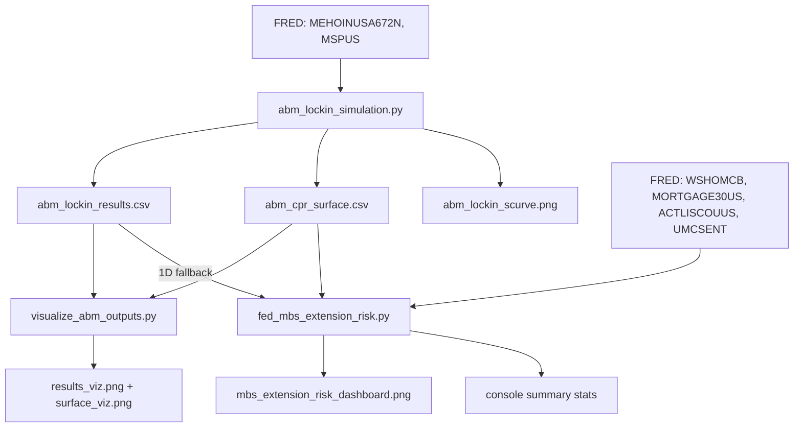

# Lock-In Effect — Mortgage Mobility, Extension Risk, and Trapped Liquidity

A quantitative research project that measures and simulates the mortgage **"lock-in effect"** — the phenomenon where households holding cheap, below-market fixed-rate mortgages refuse to move (and therefore refuse to prepay) once market rates rise. The project attacks the problem from two complementary angles and stitches them together into a single, self-consistent pipeline:

1. **Empirical macro analysis** (`fed_mbs_extension_risk.py`) — measures, from live FRED data, how the post-2022 rate shock slowed prepayments on the Federal Reserve's Mortgage-Backed Securities (MBS) portfolio, "extending" its duration and trapping liquidity far beyond the pace targeted by Quantitative Tightening (QT).
2. **Agent-based simulation** (`abm_lockin_simulation.py`) — simulates 10,000 rational households deciding whether to move under an interest-rate shock, contrasting the **U.S. par-payoff** mortgage rule against the **Danish market-price buyback** rule.

The two are linked: the ABM precomputes a behavioral **CPR (Conditional Prepayment Rate) surface**, and the macro model interpolates that surface month-by-month to build counterfactual "what the Fed's roll-off would have looked like under each institutional regime" scenarios.

---

## Table of Contents

1. [Economic Motivation](#1-economic-motivation)
2. [Repository Map](#2-repository-map)
3. [Data Flow](#3-data-flow)
4. [Script 1 — Agent-Based Model](#4-script-1--agent-based-model-abm_lockin_simulationpy)
5. [Script 2 — Macro FRED Analysis](#5-script-2--macro-fred-analysis-fed_mbs_extension_riskpy)
6. [Script 3 — Visualization Utility](#6-script-3--visualization-utility-visualize_abm_outputspy)
7. [How to Reproduce](#7-how-to-reproduce)
8. [Key Results and Interpretation](#8-key-results-and-interpretation)
9. [Dependencies](#9-dependencies)

---

## 1. Economic Motivation

### What is the lock-in effect?

A U.S. 30-year fixed mortgage originated in 2020-21 carries a coupon of roughly **3.0%**. When market rates rise to 7-8%, moving home becomes financially punitive: the household must retire the cheap loan (at par) and finance the new home at the prevailing high rate. The jump in monthly payment, compounded over an expected stay and stacked on top of transaction costs, dwarfs the non-financial benefit of moving. Households rationally stay put. This is the **lock-in effect**.

### Why it matters for the Fed

The lock-in effect has a direct balance-sheet consequence. The Fed accumulated a large MBS portfolio during pandemic-era Quantitative Easing. Its plan to shrink that portfolio (QT) relied on **passive roll-off**: as homeowners move or refinance, they prepay their mortgages, and the principal flows back to the Fed, shrinking holdings by a targeted ~$35B/month. But if nobody prepays, the bonds **extend** — their effective maturity lengthens and the portfolio stops shrinking. The gap between the targeted roll-off and the (much smaller) actual roll-off is **trapped liquidity** — money the Fed intended to drain from the system but couldn't.

### The Danish counterfactual

Denmark's mortgage system allows borrowers to **buy back** their mortgage at market price rather than at par. When rates rise, the market value of a low-coupon mortgage falls below par, so a Danish borrower can extinguish the debt at a discount — neutralizing the lock-in. Contrasting the two systems isolates how much of the trapped liquidity is a product of U.S. *institutional design* rather than rate dynamics alone.

---

## 2. Repository Map

| File | Type | Purpose |
| --- | --- | --- |
| `abm_lockin_simulation.py` | Script | Agent-based model of household mobility; produces the CPR S-curve and 2D CPR surface. |
| `fed_mbs_extension_risk.py` | Script | Empirical FRED analysis of Fed MBS extension risk; produces the 3-panel dashboard. |
| `visualize_abm_outputs.py` | Script | Standalone plotting utility for the two ABM CSV outputs. |
| `abm_lockin_results.csv` | Data (output) | CPR vs. market rate for both systems (1D S-curve data). |
| `abm_cpr_surface.csv` | Data (output) | CPR vs. (market rate × friction) for both systems (2D surface data). |
| `abm_lockin_scurve.png` | Image (output) | S-curve chart generated by the ABM script itself. |
| `abm_lockin_results_viz.png` | Image (output) | S-curve chart generated by the visualization utility. |
| `abm_cpr_surface_viz.png` | Image (output) | Heatmaps of the 2D CPR surface (U.S. vs. Danish). |
| `mbs_extension_risk_dashboard.png` | Image (output) | The 3-panel macro dashboard. |
| `requirements.txt` | Config | Python dependencies. |
| `README.md` | Docs | This document. |

---

## 3. Data Flow



The critical link is `abm_cpr_surface.csv`: the ABM writes it, and the macro model reads it to translate each month's mortgage rate and macro-friction level into a behavioral prepayment rate.

---

## 4. Script 1 — Agent-Based Model (`abm_lockin_simulation.py`)

A modular, object-oriented Monte Carlo simulation built on `numpy`, `pandas`, and `matplotlib`. It models heterogeneous households making rational move/stay decisions across a sweep of market rates.

### 4.1 Calibration constants

| Constant | Value | Meaning |
| --- | --- | --- |
| `RNG_SEED` | 42 | Reproducible random draws. |
| `N_HOUSEHOLDS` | 10,000 | Population size. |
| `ORIGINAL_RATE` | 0.03 | Coupon of the 2020-21 pandemic origination cohort (empirically the bulk of trapped Fed MBS). |
| `TERM_YEARS` | 30 | Mortgage term. |
| `MONTHS_ELAPSED` | 60 | Households are 5 years into their mortgage at simulation start. |
| `EXPECTED_STAY_MONTHS` | 60 | Horizon over which payment penalties are felt. |
| `TRANSACTION_COST_MEAN / STD / FLOOR / CAP` | 0.07 / 0.015 / 0.02 / 0.12 | Per-agent transaction cost rate as a fraction of home value, drawn from a clipped normal. |
| `MOBILITY_DESIRE_SCALE` | 12,500 (default) | Seed for the exponential mobility-desire distribution; recalibrated at runtime. |
| `RATE_GRID` | 2.0% → 8.0%, step 0.5% | Market-rate sweep. |
| `FRICTION_GRID` | 7.0% → 11.0%, step 0.5% | Friction axis for the 2D surface (covers the macro friction range with margin). |

### 4.2 FRED data pull — `fetch_macro_from_fred()`

Pulls the latest empirical medians used to seed the household population, with graceful offline fallbacks:

- `MEHOINUSA672N` — Real Median Household Income (annual) → seeds the income distribution.
- `MSPUS` — Median Sales Price of Houses Sold (quarterly) → seeds the home-value distribution.

If the API is unreachable, falls back to `FALLBACK_MEDIAN_INCOME = 80,000` and `FALLBACK_MEDIAN_HOME_VALUE = 420,000`.

### 4.3 Class 1 — `Mortgage`

A fixed-rate, fully amortizing mortgage with closed-form amortization math:

- `calculate_monthly_payment()` — standard annuity payment: `P · r / (1 − (1+r)^−n)`.
- `outstanding_principal()` — closed-form remaining balance after `months_elapsed` payments.
- `remaining_term_months()` — months left on the schedule.

The two institutional payoff rules are the heart of the comparison:

- **`get_payoff_cost_us(rate)`** — always returns the **outstanding principal** (par). A below-market mortgage cannot be retired cheaply; it is a golden handcuff.
- **`get_payoff_cost_danish(rate)`** — returns the **present value of the remaining scheduled payments**, discounted at the current market rate, **capped at par** (since Danish mortgages are also callable at par when rates are below the coupon). When rates rise, this PV drops below par, letting the borrower retire the debt at a discount.

### 4.4 Class 2 — `Household`

Attributes: `income`, `current_home_value`, `mortgage`, `mobility_desire` (a dollar-equivalent benefit of moving), and a per-agent `transaction_cost_rate`.

**`evaluate_move(current_market_rate, system_type, friction=TRANSACTION_COST_MEAN)`** is the rational decision:

1. Compute the system-specific payoff cost of the existing mortgage.
2. Finance that payoff with a **new** mortgage at today's market rate; compute the new monthly payment.
3. The monthly payment penalty is `new_payment − current_payment`, felt over `EXPECTED_STAY_MONTHS`.
4. The transaction cost uses an **offset-preserving friction model**: each agent's idiosyncratic deviation from the base mean (`offset = transaction_cost_rate − TRANSACTION_COST_MEAN`) is added to the macro `friction` argument, then clipped to `[FLOOR, CAP]`. When `friction == 0.07` the behavior is identical to a static-cost model, so the calibration and S-curve are preserved — but the macro model can shift the whole population's friction up during tight markets.
5. Move iff `mobility_desire > monthly_penalty · EXPECTED_STAY_MONTHS + transaction_cost`.

### 4.5 Class 3 — `HousingMarketEngine`

Generates the population and runs experiments.

- **`_generate_population()`** — draws 10,000 households:
  - Income ~ lognormal centered on the FRED median (σ = 0.45).
  - Home value ~ lognormal centered on the FRED median (σ = 0.35).
  - Mobility desire ~ exponential with the (calibrated) `mobility_scale`.
  - Transaction cost rate ~ normal(7%, 1.5%) clipped to [2%, 12%].
  - Each mortgage is originated at 80% LTV on the home value, at `ORIGINAL_RATE`.
- **`cpr_at(rate, system_type, friction)`** — fraction of the population that moves at a given rate/friction = the Conditional Prepayment Rate.
- **`run_simulation()`** — sweeps `RATE_GRID` at base friction → the 1D S-curve.
- **`build_cpr_surface()`** — sweeps the full `FRICTION_GRID × RATE_GRID` → the 2D surface (13 rates × 9 friction levels).

### 4.6 Calibration — `calibrate_mobility_scale()`

The non-financial mobility desire is unobservable, so it is **anchored to a known empirical target**: under maximum lock-in (8% market rate, U.S. par rule), real-world involuntary turnover (death, divorce, default, forced relocation) produces a CPR floor of roughly **4-5%**. A binary search over the exponential scale parameter (bounds 1,000 → 500,000, up to 30 iterations) tunes the distribution until `cpr_at(0.08, "US")` lands inside the 4-5% band. This makes the behavioral layer empirically grounded rather than arbitrary.

### 4.7 Outputs

- `abm_lockin_results.csv` — columns `Market_Rate, CPR_US, CPR_Danish` (decimals).
- `abm_cpr_surface.csv` — columns `Market_Rate, Friction, CPR_US, CPR_Danish` (decimals).
- `abm_lockin_scurve.png` — the publication-quality S-curve.

---

## 5. Script 2 — Macro FRED Analysis (`fed_mbs_extension_risk.py`)

Quantifies the Fed's MBS extension risk from live data and overlays the ABM behavioral counterfactuals.

### 5.1 Data pipeline — `fetch_data()`

Pulls four FRED series and aligns them onto a clean monthly timeline:

| Ticker | Series | Role | Resampling |
| --- | --- | --- | --- |
| `WSHOMCB` | Fed MBS holdings (weekly) | Balance-sheet stock | `.resample("ME").last()` (end-of-month level) |
| `MORTGAGE30US` | 30-yr fixed rate (weekly) | Market rate | `.resample("ME").mean()` (monthly average) |
| `ACTLISCOUUS` | Realtor.com active listings | Search friction driver | `.resample("ME").last()` |
| `UMCSENT` | U. Michigan consumer sentiment | Psychological friction driver | `.resample("ME").mean()` |

The friction drivers are pulled from `BASELINE_START = 2017-01-01` (vs. `START_DATE = 2021-01-01` for the balance sheet) so a healthy pre-pandemic **2017-2019 inventory baseline** can be computed. That baseline is stashed in `df.attrs["inventory_baseline"]`. All friction columns are aligned to the monthly index and `ffill().bfill()`-ed so there are never NaNs.

> **Why monthly resampling matters:** an earlier version summed overlapping 4-week roll-off windows on weekly data, inflating trapped liquidity into the trillions. Resampling to true calendar-month frequency and differencing once per month (`diff(periods=1)`) fixed the double-counting.

### 5.2 QT policy modeling

- `QT_START = 2022-06-01`, `QT_END = 2025-12-01` (the Fed officially ended QT in December 2025).
- **`compute_qt_target_series(index)`** builds a time-dependent target: `NaN` before QT, **−35B/month** while active, **0B/month** after QT ends. This stepped target drives the bar coloring, extension-delta math, and the flatlining of cumulative trapped liquidity.

### 5.3 Dynamic Macroeconomic Friction — `calculate_dynamic_friction()`

Instead of a static 7% transaction cost, friction floats month-by-month between **7.0% and 10.5%** based on two real-world drivers:

- **Search penalty** (low inventory ⇒ harder to find a home): `shortfall = max(0, baseline − inventory)`, scaled so the lowest-inventory month hits the cap of **+200 bps** (`SEARCH_PENALTY_CAP = 0.02`).
- **Sentiment penalty** (fear ⇒ reluctance to transact): **+5 bps per point** that `UMCSENT` falls below the healthy baseline of 85.0, capped at **+150 bps** (`SENTIMENT_PENALTY_CAP = 0.015`).
- `Dynamic_Friction = 0.07 + search_penalty + sentiment_penalty`.

### 5.4 CPR surface interpolation

- **`load_cpr_surface()`** — reads `abm_cpr_surface.csv`, pivots it into ascending grids `rates_pct`, `frictions`, and 2D CPR arrays `Z_US`, `Z_DK`.
- **`interp_cpr_surface(rate, friction, surface)`** — manual **bilinear interpolation** via nested `np.interp` (interpolate over rate for each friction column, then over friction). No SciPy dependency; out-of-range inputs are clamped.
- **1D fallback** — if `abm_cpr_surface.csv` is absent, the model degrades gracefully to `load_abm_anchors()` (extracts CPR anchors at 3%/5%/8% from `abm_lockin_results.csv`) + `compute_abm_cpr_vectors()` (1D `np.interp` at base friction). Hardcoded fallback anchors exist for fully-offline first runs.

### 5.5 Metric computation — `compute_metrics()`

1. **Actual roll-off**: `WSHOMCB.diff(1) / 1000` (month-over-month change, M→B).
2. **Extension delta**: `actual − QT_target` (only meaningful once QT begins).
3. **Cumulative trapped liquidity (empirical)**: cumulative sum of positive deltas, accumulating only while QT is active and **flatlining at its peak after Dec 2025** (a permanent trap).
4. **Dynamic friction**: computed first so the surface can be sampled at each month's `(rate, friction)` coordinate.
5. **ABM counterfactual CPR paths**: `US_CPR_Pct`, `Danish_CPR_Pct` interpolated from the surface.
6. **Simulated roll-off**: `−holdings · (CPR / 12)` — the monthly prepayment intensity applied to the portfolio, comparable to the −35B target.
7. **Per-system extension deltas, missed roll-off, and cumulative trapped liquidity** for both the U.S. and Danish counterfactuals (same QT-active / flatline logic).

### 5.6 Three-panel dashboard — `plot_dashboard()`

- **Panel 1** — Fed MBS holdings ($B) and the 30-yr mortgage rate on a dual axis, with the QT era shaded.
- **Panel 2** — Actual monthly roll-off bars (green = target met, orange = missed), overlaid with the ABM U.S. and Danish simulated roll-off lines and the stepped QT target. A dotted **Dynamic Friction (%)** line on a twin axis shows the friction regime. A vertical marker flags QT end.
- **Panel 3** — Cumulative trapped liquidity for the U.S. (dark red) and Danish (orange) counterfactuals as filled areas, with terminal-value annotations and a QT-end marker labeling the permanent trap.

### 5.7 Summary statistics — `print_summary()`

Prints the active QT period, targets, average actual roll-off, total empirical trapped liquidity, the ABM-calibrated U.S. and Danish trapped-liquidity totals, the **institutional gap** (U.S. − Danish), and the dynamic-friction min/mean/max.

---

## 6. Script 3 — Visualization Utility (`visualize_abm_outputs.py`)

A standalone, dependency-light plotting tool (no FRED key required) that renders the two ABM CSVs into publication-quality PNGs.

- **`load_csv(path, required)`** — reads a CSV and fails fast with a clear message if the file is missing, a required column is absent, or the file is empty.
- **`plot_results_scurve()`** — the 1D S-curve (U.S. vs. Danish) with the **lock-in gap shaded** between the curves and a reference line at the 3.0% original coupon → `abm_lockin_results_viz.png`.
- **`plot_cpr_surface()`** — side-by-side `imshow` heatmaps of the 2D CPR surface (rate × friction) for the two systems, sharing one color scale and a common colorbar, with per-cell CPR annotations → `abm_cpr_surface_viz.png`.

---

## 7. How to Reproduce

### Prerequisites

- Python 3.9+
- A free FRED API key from <https://fred.stlouisfed.org/docs/api/api_key.html> (already set in both scripts; replace if you fork).

### Install

```bash
pip install -r requirements.txt
```

### Run order

The ABM must run first so the macro model can read the CPR surface:

```bash
# 1. Agent-based model → writes abm_lockin_results.csv, abm_cpr_surface.csv, abm_lockin_scurve.png
python abm_lockin_simulation.py

# 2. Macro analysis → reads the surface, writes mbs_extension_risk_dashboard.png + console summary
python fed_mbs_extension_risk.py

# 3. (Optional) Re-render the ABM CSVs as standalone charts
python visualize_abm_outputs.py
```

> **Headless environments:** if you run on a machine without a display, set `MPLBACKEND=Agg` (and a writable `MPLCONFIGDIR`) so matplotlib saves PNGs without trying to open a window.

### Expected generated files

`abm_lockin_results.csv`, `abm_cpr_surface.csv`, `abm_lockin_scurve.png`, `abm_lockin_results_viz.png`, `abm_cpr_surface_viz.png`, `mbs_extension_risk_dashboard.png`.

---

## 8. Key Results and Interpretation

- **The S-curve** — As market rates climb from the 3% coupon toward 8%, the U.S. mobility curve **collapses toward its ~4.6% involuntary floor**, while the Danish curve stays high (~32%). The shaded gap between them is pure institutional lock-in: identical households, identical rates, different mortgage rules.
- **The macro dashboard** — Actual Fed roll-off chronically undershoots the −35B QT target during the high-rate window; the cumulative shortfall is the trapped-liquidity "mountain." The ABM counterfactual shows that under the U.S. regime roll-off all but stalls, while under the Danish regime it would have continued — the difference is the **institutional gap** reported in the summary.
- **Dynamic friction** — During 2021-2025, depressed housing inventory and weak consumer sentiment pushed effective friction to roughly **8-10%** (well above the 7% static baseline). Higher friction suppresses simulated CPR at any given rate, **amplifying** the lock-in and deepening the trap beyond what rates alone would predict.

---

## 9. Dependencies

- Python 3.9+
- `pandas`, `numpy`, `matplotlib`, `fredapi` (see `requirements.txt`)
- A free FRED API key (see above)

All interpolation is pure NumPy — **no SciPy required**.
