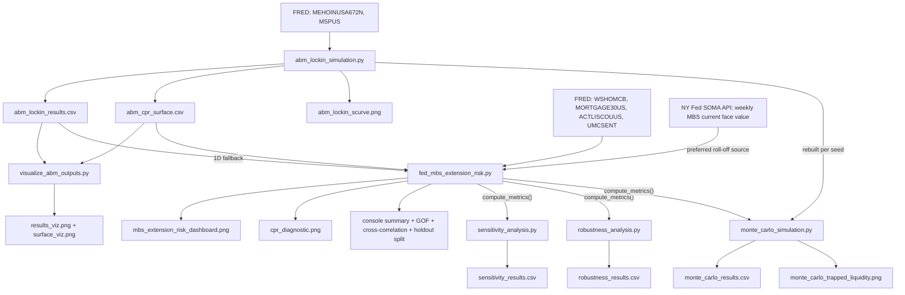

# Lock-In Effect — ABM Pipeline

> **Location:** this is the **agent-based model** subproject. The repo root [README.md](../README.md) indexes this folder and the [`../hazard/`](../hazard/) reduced-form hazard framework (cohort hazard + literature microsim with competing risks).

> **Currency note (July 2026):** results quoted in this runbook predate the
> repository-wide robustness program. Current production is
> **$84.5B / 11.1%** U.S. trapped (`run-2026-07-05-berger`), Danish CPR
> **3.4%** under the Berger recalibration (the $930.3B institutional gap is
> superseded — see root [TECHNICAL.md §20](../TECHNICAL.md)), and Monte Carlo
> mean **$96.7B**, seed-draw std **$24.8B** (headline $84.5B ± $25B, 1σ
> population-draw; per TECHNICAL.md §12, do not quote the CI of the mean as
> the uncertainty range). This document remains accurate as
> the pre-program record.

Extension-risk scoring can use the literature hazard microsim instead of the utility ABM CPR surface:

```python
# fed_mbs_extension_risk.py
df = compute_metrics(df, use_hazard_microsim=True)
```

See [`../hazard/README.md`](../hazard/README.md) for the microsim architecture (cohort-level burnout, Rothstein β₁ survival conversion, Danish rate-gap swap).

A quantitative research project that measures and simulates the mortgage **"lock-in effect"** — the phenomenon where households holding cheap, below-market fixed-rate mortgages refuse to move (and therefore refuse to prepay) once market rates rise. The project attacks the problem from two complementary angles and stitches them together into a single, self-consistent pipeline, then stress-tests the result with a four-part validation suite:

1. **Empirical macro analysis** ([fed_mbs_extension_risk.py](fed_mbs_extension_risk.py)) — measures, from live FRED and NY Fed SOMA data, how the post-2022 rate shock slowed prepayments on the Federal Reserve's Mortgage-Backed Securities (MBS) portfolio, "extending" its duration and trapping liquidity far beyond the pace targeted by Quantitative Tightening (QT).
2. **Agent-based simulation** ([abm_lockin_simulation.py](abm_lockin_simulation.py)) — simulates 10,000 households deciding whether to move under an interest-rate shock, incorporating a **DTI credit constraint** (43% QM hard wall), **asymmetric loss aversion** (Kahneman-Tversky 2.25x), and a **wait-and-see freeze** (20% under high rate velocity), contrasting the **U.S. par-payoff** mortgage rule against the **Danish market-price buyback** rule.
3. **Validation suite** ([sensitivity_analysis.py](sensitivity_analysis.py), [robustness_analysis.py](robustness_analysis.py), [monte_carlo_simulation.py](monte_carlo_simulation.py)) — sweeps friction parameters, data sources, cap-schedule assumptions, and ABM population draws, plus an in-sample/out-of-sample holdout split, to check that the headline result isn't an artifact of any single modeling choice.

The two core models are linked: the ABM precomputes a 3D behavioral **CPR (Conditional Prepayment Rate) surface** per coupon cohort over `(rate × friction × rate_velocity)`, and the macro model interpolates those surfaces month-by-month (weighted by live NY Fed SOMA composition) to build counterfactual "what the Fed's roll-off would have looked like under each institutional regime" scenarios — including **scheduled amortization** and **income-scaled curtailment** (partial voluntary prepayments), so the comparison is apples-to-apples with reality.

> **For the full technical narrative of every bug found and fixed in this project (the corrected $972B→$673B benchmark, the Danish counterfactual bug history, goodness-of-fit methodology, and the holdout-split results), see root [TECHNICAL.md](../TECHNICAL.md) — granular ABM-era detail is in its [Appendix B](../TECHNICAL.md#appendix-b--abm-era-granular-archaeology).**

---

## Table of Contents

1. [Economic Motivation](#1-economic-motivation)
2. [Repository Map](#2-repository-map)
3. [Data Flow](#3-data-flow)
4. [Script 1 — Agent-Based Model](#4-script-1--agent-based-model-abm_lockin_simulationpy)
5. [Script 2 — Macro FRED/SOMA Analysis](#5-script-2--macro-fredsoma-analysis-fed_mbs_extension_riskpy)
6. [Script 3 — Visualization Utility](#6-script-3--visualization-utility-visualize_abm_outputspy)
7. [Scripts 4-6 — Validation Suite](#7-scripts-4-6--validation-suite)
8. [How to Reproduce](#8-how-to-reproduce)
9. [Key Results and Interpretation](#9-key-results-and-interpretation)
10. [Dependencies](#10-dependencies)

---

## 1. Economic Motivation

### What is the lock-in effect?

A U.S. 30-year fixed mortgage originated in 2020-21 carries a coupon of roughly **3.0%**. When market rates rise to 7-8%, moving home becomes financially punitive: the household must retire the cheap loan (at par) and finance the new home at the prevailing high rate. The jump in monthly payment, compounded over an expected stay and stacked on top of transaction costs, dwarfs the non-financial benefit of moving. Households rationally stay put. This is the **lock-in effect**.

### Why it matters for the Fed

The lock-in effect has a direct balance-sheet consequence. The Fed accumulated a large MBS portfolio during pandemic-era Quantitative Easing. Its plan to shrink that portfolio (QT) relied on **passive roll-off**: as homeowners move, refinance, or simply pay down scheduled principal, cash flows back to the Fed, shrinking holdings by a targeted pace (phased from $17.5B/month up to $35B/month — see [Section 5.2](#52-qt-policy-modeling)). But if prepayments stall, the bonds **extend** — their effective maturity lengthens and the portfolio shrinks far slower than intended. The gap between the targeted roll-off and the actual roll-off is **trapped liquidity** — money the Fed intended to drain from the system but couldn't.

### The Danish counterfactual

Denmark's mortgage system allows borrowers to **buy back** their mortgage at market price rather than at par. When rates rise, the market value of a low-coupon mortgage falls below par, so a Danish borrower can extinguish the debt at a discount — neutralizing the lock-in. Contrasting the two systems isolates how much of the trapped liquidity is a product of U.S. *institutional design* rather than rate dynamics alone. This counterfactual is now simulated with a **dynamic declining balance** (see [Section 5.5](#55-metric-computation--compute_metrics)) rather than applied to a static portfolio, so the comparison reflects what actually would have happened to the Danish balance path.

---

## 2. Repository Map

| File | Type | Purpose |
| --- | --- | --- |
| `abm_lockin_simulation.py` | Script | Agent-based model of household mobility; produces the CPR S-curve and 2D CPR surface. |
| `fed_mbs_extension_risk.py` | Script | Empirical FRED/SOMA analysis of Fed MBS extension risk; produces the 3-panel dashboard and CPR diagnostic. |
| `visualize_abm_outputs.py` | Script | Standalone plotting utility for the two ABM CSV outputs. |
| `sensitivity_analysis.py` | Script | Sweeps the 3 dynamic-friction parameters (125 scenarios); reports trapped liquidity, share-explained, and CPR goodness-of-fit for each. |
| `robustness_analysis.py` | Script | Sweeps data source (SOMA vs. WSHOMCB) and QT cap-schedule assumptions (18 scenarios); checks the empirical benchmark isn't an artifact of one data/assumption choice. |
| `monte_carlo_simulation.py` | Script | Reruns the full ABM→macro pipeline 50 times with different household population seeds; reports the mean, std, and 95% CI of U.S. trapped liquidity. |
| `abm_external_gates.py` | Script | Round-15 Q4 externally anchored gates variant (L&R zero-gap mobility anchor, no floor recalibration; 150.6% recovery with CPR(8%)=0% — [TECHNICAL.md §25.3](../TECHNICAL.md)). |
| *(post-program modules)* | Scripts | `freeze_run.py` (tagged manifests), `paths.py`, `refi_sweep.py`, `cross_design_test.py`, `hybrid_pipeline.py`, `freddie_population.py` — see [TECHNICAL.md](../TECHNICAL.md) §§14–25 for each module's run record. |
| `abm_lockin_results.csv` | Data (output) | CPR vs. market rate for both systems (1D S-curve data). |
| `abm_cpr_surface.csv` | Data (output) | CPR vs. (market rate × friction) for both systems (2D surface data). |
| `sensitivity_results.csv` | Data (output) | Full 125-row friction-parameter sweep. |
| `robustness_results.csv` | Data (output) | Full data-source and cap-schedule sweep. |
| `monte_carlo_results.csv` | Data (output) | 50 trapped-liquidity draws, one per random seed. |
| `abm_lockin_scurve.png` | Image (output) | S-curve chart generated by the ABM script itself. |
| `abm_lockin_results_viz.png` | Image (output) | S-curve chart generated by the visualization utility. |
| `abm_cpr_surface_viz.png` | Image (output) | Heatmaps of the 2D CPR surface (U.S. vs. Danish). |
| `mbs_extension_risk_dashboard.png` | Image (output) | The 3-panel macro dashboard. |
| `cpr_diagnostic.png` | Image (output) | Two-panel chart comparing ABM-predicted CPR against empirical (SOMA-implied) CPR. |
| `monte_carlo_trapped_liquidity.png` | Image (output) | Histogram of the 50 Monte Carlo trapped-liquidity draws vs. the empirical benchmark. |
| `requirements.txt` | Config | Python dependencies. |
| `README.md` | Docs | This document — project overview and how-to-reproduce. |
| `../TECHNICAL.md` | Docs | Technical narrative of corrections and validation methodology (ABM-era detail: Appendix B). |

---

## 3. Data Flow



The critical link is `abm_cpr_surface.csv`: the ABM writes it, and the macro model reads it to translate each month's mortgage rate and macro-friction level into a behavioral prepayment rate. The three validation scripts all sit downstream of `fed_mbs_extension_risk.compute_metrics()`, re-invoking it with different inputs (friction parameters, data source, cap schedule, or ABM population) to stress-test the headline numbers.

---

## 4. Script 1 — Agent-Based Model (`abm_lockin_simulation.py`)

A modular, object-oriented Monte Carlo simulation built on `numpy`, `pandas`, and `matplotlib`. It models heterogeneous households making rational move/stay decisions across a sweep of market rates.

### 4.1 Calibration constants

| Constant | Value | Meaning |
| --- | --- | --- |
| `RNG_SEED` | 42 | Reproducible random draws. |
| `N_HOUSEHOLDS` | 10,000 | Population size. |
| `ORIGINAL_RATE` | 0.03 | Legacy single-cohort fallback coupon; live runs use NY Fed CUSIP-level multi-cohort weights (WAC ≈ 2.55%). |
| `TERM_YEARS` | 30 | Mortgage term. |
| `MONTHS_ELAPSED` | 60 | Households are 5 years into their mortgage at simulation start. |
| `EXPECTED_STAY_MONTHS` | 60 | Horizon over which payment penalties are felt. |
| `TRANSACTION_COST_MEAN / STD / FLOOR / CAP` | 0.07 / 0.015 / 0.02 / 0.12 | Per-agent transaction cost rate as a fraction of home value, drawn from a clipped normal. |
| `MOBILITY_DESIRE_SCALE` | 12,500 (default) | Seed for the exponential mobility-desire distribution; recalibrated at runtime. |
| `RATE_GRID` | 2.0% → 8.0%, step 0.5% | Market-rate sweep. |
| `FRICTION_GRID` | 5.0% → 17.5%, step 0.5% | Friction axis for the 2D surface — widened beyond the macro model's default 7-10.5% floating range so `sensitivity_analysis.py` can sweep extreme friction parameters without clamping at a grid boundary. |

### 4.2 FRED data pull — `fetch_macro_from_fred()`

Pulls the latest empirical medians used to seed the household population, with graceful offline fallbacks:

- `MEHOINUSA672N` — Real Median Household Income (annual) → seeds the income distribution.
- `MSPUS` — Median Sales Price of Houses Sold (quarterly) → seeds the home-value distribution.

If the API is unreachable, falls back to `FALLBACK_MEDIAN_INCOME = 80,000` and `FALLBACK_MEDIAN_HOME_VALUE = 420,000`.

### 4.3 Class 1 — `Mortgage`

A fixed-rate, fully amortizing mortgage with closed-form amortization math:

- `calculate_monthly_payment()` — standard annuity payment: `P · r / (1 − (1+r)^−n)`.
- `outstanding_principal()` — closed-form remaining balance after `months_elapsed` payments.
- `remaining_term_months()` — months left on the schedule.

The two institutional payoff rules are the heart of the comparison:

- **`get_payoff_cost_us(rate)`** — always returns the **outstanding principal** (par). A below-market mortgage cannot be retired cheaply; it is a golden handcuff.
- **`get_payoff_cost_danish(rate)`** — returns the **present value of the remaining scheduled payments**, discounted at the current market rate, **capped at par** (since Danish mortgages are also callable at par when rates are below the coupon). When rates rise, this PV drops below par, letting the borrower retire the debt at a discount.

### 4.4 Class 2 — `Household`

Attributes: `income`, `current_home_value`, `mortgage`, `mobility_desire` (a dollar-equivalent benefit of moving), and a per-agent `transaction_cost_rate`.

**`evaluate_move(current_market_rate, system_type, friction=TRANSACTION_COST_MEAN)`** is the rational decision:

1. Compute the system-specific payoff cost of the existing mortgage.
2. Finance that payoff with a **new** mortgage at today's market rate; compute the new monthly payment.
3. The monthly payment penalty is `new_payment − current_payment`, felt over `EXPECTED_STAY_MONTHS`.
4. The transaction cost uses an **offset-preserving friction model**: each agent's idiosyncratic deviation from the base mean (`offset = transaction_cost_rate − TRANSACTION_COST_MEAN`) is added to the macro `friction` argument, then clipped to `[FLOOR, CAP]`. When `friction == 0.07` the behavior is identical to a static-cost model, so the calibration and S-curve are preserved — but the macro model can shift the whole population's friction up during tight markets.
5. Move iff `mobility_desire > monthly_penalty · EXPECTED_STAY_MONTHS + transaction_cost`.

### 4.5 Class 3 — `HousingMarketEngine`

Generates the population and runs experiments.

- **`_generate_population()`** — draws 10,000 households:
  - Income ~ lognormal centered on the FRED median (σ = 0.45).
  - Home value ~ lognormal centered on the FRED median (σ = 0.35).
  - Mobility desire ~ exponential with the (calibrated) `mobility_scale`.
  - Transaction cost rate ~ normal(7%, 1.5%) clipped to [2%, 12%].
  - Each mortgage is originated at 80% LTV on the home value, at `ORIGINAL_RATE`.
- **`cpr_at(rate, system_type, friction)`** — fraction of the population that moves at a given rate/friction = the Conditional Prepayment Rate.
- **`run_simulation()`** — sweeps `RATE_GRID` at base friction → the 1D S-curve.
- **`build_cpr_surface()`** — sweeps the full `FRICTION_GRID × RATE_GRID` → the 2D surface (13 rates × 26 friction levels).

### 4.6 Calibration — `calibrate_mobility_scale()`

The non-financial mobility desire is unobservable, so it is **anchored to a known empirical target**: under maximum lock-in (8% market rate, U.S. par rule), real-world involuntary turnover (death, divorce, default, forced relocation) produces a CPR floor of roughly **4-5%**. A binary search over the exponential scale parameter (bounds 1,000 → 500,000, up to 30 iterations) tunes the distribution until `cpr_at(0.08, "US")` lands inside the 4-5% band. This makes the behavioral layer empirically grounded rather than arbitrary.

### 4.7 Outputs

- `abm_lockin_results.csv` — columns `Market_Rate, CPR_US, CPR_Danish` (decimals).
- `abm_cpr_surface.csv` — columns `Market_Rate, Friction, CPR_US, CPR_Danish` (decimals).
- `abm_lockin_scurve.png` — the publication-quality S-curve.

---

## 5. Script 2 — Macro FRED/SOMA Analysis (`fed_mbs_extension_risk.py`)

Quantifies the Fed's MBS extension risk from live data and overlays the ABM behavioral counterfactuals.

### 5.1 Data pipeline — `fetch_data()` and `fetch_soma_mbs_monthly()`

`fetch_data()` pulls four FRED series and aligns them onto a clean monthly timeline:

| Ticker | Series | Role | Resampling |
| --- | --- | --- | --- |
| `WSHOMCB` | Fed MBS holdings (weekly) | Balance-sheet stock (fallback roll-off source) | `.resample("ME").last()` (end-of-month level) |
| `MORTGAGE30US` | 30-yr fixed rate (weekly) | Market rate | `.resample("ME").mean()` (monthly average) |
| `ACTLISCOUUS` | Realtor.com active listings | Search friction driver | `.resample("ME").last()` |
| `UMCSENT` | U. Michigan consumer sentiment | Psychological friction driver | `.resample("ME").mean()` |

The friction drivers are pulled from `BASELINE_START = 2017-01-01` (vs. `START_DATE = 2021-01-01` for the balance sheet) so a healthy pre-pandemic **2017-2019 inventory baseline** can be computed. That baseline is stashed in `df.attrs["inventory_baseline"]`. All friction columns are aligned to the monthly index and `ffill().bfill()`-ed so there are never NaNs.

**`fetch_soma_mbs_monthly()`** pulls weekly SOMA MBS current-face-value holdings directly from the NY Fed Markets API (`markets.newyorkfed.org/api/soma/summary.json`), resamples to month-end, and differences to get the preferred actual roll-off series. Because SOMA reports current face value (remaining unpaid principal) rather than `WSHOMCB`'s amortized cost, this also avoids the premium/discount amortization drift baked into FRED's balance-sheet series — SOMA MBS were largely bought at a premium during QE, so amortized cost declines independent of actual principal paydown, while current face value does not have this issue (see [TECHNICAL.md Appendix B.1](../TECHNICAL.md#b1-benchmark-accounting-detail) for the full accounting explanation). Both series remain settlement-date based, so TBA-settlement lag is a limitation neither source fixes on its own. If the API is unreachable, `compute_metrics()` falls back to `WSHOMCB.diff()` automatically.

### 5.2 QT policy modeling

- `QT_START = 2022-06-01`, `QT_RAMP_END = 2022-09-01`, `QT_END = 2025-12-01` (the Fed officially ended QT in December 2025).
- **`compute_qt_target_series(index)`** builds a **phased** time-dependent target: `NaN` before QT, **−$17.5B/month** during the June-August 2022 ramp-up, **−$35B/month** at full pace from September 2022, and **$0B/month** after QT ends. This phased cap (rather than a flat −$35B from day one) is one of the corrections that brought the headline empirical figure down from the original, inflated $972.3B — see [TECHNICAL.md §3](../TECHNICAL.md#3-empirical-benchmark-from-9723b-to-7647b).

### 5.3 Dynamic Macroeconomic Friction — `calculate_dynamic_friction()`

Instead of a static 7% transaction cost, friction floats month-by-month based on two real-world drivers, using the module's `BASE_FRICTION`, `SEARCH_PENALTY_CAP`, and `SENTIMENT_PENALTY_CAP` defaults (all exposed as keyword arguments so `sensitivity_analysis.py` can sweep them):

- **Search penalty** (low inventory ⇒ harder to find a home): `shortfall = max(0, baseline − inventory)`, scaled so the lowest-inventory month hits the cap of **+200 bps**.
- **Sentiment penalty** (fear ⇒ reluctance to transact): **+5 bps per point** that `UMCSENT` falls below the healthy baseline of 85.0, capped at **+150 bps**.
- `Dynamic_Friction = base_friction + search_penalty + sentiment_penalty` — with default parameters this floats between roughly 8.2% and 10.3% over the QT window.

### 5.4 CPR surface interpolation

- **`load_cpr_surface()`** — reads `abm_cpr_surface.csv`, pivots it into ascending grids `rates_pct`, `frictions`, and 2D CPR arrays `Z_US`, `Z_DK`.
- **`interp_cpr_surface(rate, friction, surface)`** — manual **bilinear interpolation** via nested `np.interp` (interpolate over rate for each friction column, then over friction). No SciPy dependency; out-of-range inputs are clamped.
- **1D fallback** — if `abm_cpr_surface.csv` is absent, the model degrades gracefully to `load_abm_anchors()` (extracts CPR anchors at 3%/5%/8% from `abm_lockin_results.csv`) + `compute_abm_cpr_vectors()` (1D `np.interp` at base friction). Hardcoded fallback anchors exist for fully-offline first runs.

### 5.5 Metric computation — `compute_metrics()`

1. **Actual roll-off**: SOMA-derived monthly diff (preferred) or `WSHOMCB.diff(1) / 1000` (fallback).
2. **Extension delta**: `actual − QT_target` (only meaningful once QT begins), using the phased target from §5.2.
3. **Cumulative trapped liquidity (empirical)**: **net** cumulative sum of the delta (overshoot months offset shortfall months), accumulating only while QT is active and **flatlining at its terminal value after Dec 2025** (a permanent trap).
4. **Scheduled amortization**: `scheduled_amortization_series()` computes the month-by-month scheduled-principal fraction (SMM) for a representative 3.0%-coupon, 30-year, mid-2020-origination mortgage — the principal that flows through *regardless of prepayment*. This is added to CPR-driven prepayment in every simulated roll-off calculation so the ABM isn't missing a structural cash-flow component.
5. **Empirical CPR extraction**: `Empirical_CPR_Pct` backs the implied prepayment rate out of actual roll-off minus the scheduled-amortization component, enabling a direct, apples-to-apples comparison against the ABM's predicted CPR.
6. **Dynamic friction**: computed first so the CPR surface can be sampled at each month's `(rate, friction)` coordinate.
7. **ABM counterfactual CPR paths**: `US_CPR_Pct`, `Danish_CPR_Pct` interpolated from the surface.
8. **U.S. simulated roll-off**: `−holdings · (CPR/12 + scheduled_SMM)` applied to the actual (observed) balance path, since the ABM's U.S. CPR is meant to approximate reality.
9. **Danish simulated roll-off — dynamic balance**: rather than applying the much higher Danish CPR (**36–51%** on the current multi-cohort 3D surface; mean **47.2%** over the active QT window) to the static U.S. balance, the code simulates the Danish portfolio balance **forward month-by-month from the QT-start level**, so each month's roll-off is applied to the *already-shrunk* balance. Headline figures are frozen per run tag (`python3 freeze_run.py`; see `data/runs/`). See [TECHNICAL.md §7](../TECHNICAL.md#7-danish-counterfactual-three-stages-of-bugs) for the full bug history.
10. **Per-system extension deltas, missed roll-off, and cumulative trapped liquidity** for both the U.S. and Danish counterfactuals (same QT-active / flatline logic, net accumulation as in step 3).

### 5.6 Goodness-of-fit and diagnostics — `cpr_goodness_of_fit()`, `cpr_cross_correlation()`

- **`cpr_goodness_of_fit(empirical, predicted)`** computes R², RMSE, MAE, and Pearson r comparing the ABM's monthly CPR predictions to the empirical (SOMA-implied) CPR, both raw and on a 3-month centered rolling average ("smoothed").
- **`cpr_cross_correlation(empirical, predicted, max_lag=3)`** computes the same Pearson r at lags −3 to +3 months, to check whether any apparent mismatch is a settlement-timing lag (which lag-alignment could fix) versus a genuine structural sign mismatch (which it can't).
- `print_summary()` also reports an **in-sample / out-of-sample holdout split** at January 2024, comparing R², RMSE, and share-explained on data the friction parameters implicitly "saw" (Jun 2022 - Dec 2023) versus data they didn't (Jan 2024 onward) — a check against pure curve-fitting.

### 5.7 Three-panel dashboard — `plot_dashboard()`

- **Panel 1** — Fed MBS holdings ($B) and the 30-yr mortgage rate on a dual axis, with the QT era shaded.
- **Panel 2** — Actual monthly roll-off bars (green = target met, orange = missed), overlaid with the ABM U.S. and Danish simulated roll-off lines and the stepped, phased QT target. A dotted **Dynamic Friction (%)** line on a twin axis shows the friction regime. A vertical marker flags QT end.
- **Panel 3** — Cumulative trapped liquidity for the U.S. (dark red) and Danish (orange) counterfactuals as filled areas, with terminal-value annotations and a QT-end marker labeling the permanent trap.

### 5.8 CPR diagnostic chart — `plot_cpr_diagnostic()`

A separate two-panel chart (`cpr_diagnostic.png`): a time-series overlay of empirical vs. ABM CPR with the gap shaded, and a scatter of both series against the month's mortgage rate (colored by date) to visualize where the ABM over- or under-predicts along the rate curve.

### 5.9 Summary statistics — `print_summary()`

Prints the active QT period, phased targets, average actual roll-off, total empirical trapped liquidity, the ABM-calibrated U.S. and Danish trapped-liquidity totals (with the U.S. share-of-empirical percentage and the Danish portfolio's dynamic balance path), the **institutional gap** (U.S. − Danish), scheduled-amortization contribution, CPR goodness-of-fit (raw + smoothed), cross-correlation at lags −3..+3, the holdout-split comparison, and the dynamic-friction min/mean/max.

---

## 6. Script 3 — Visualization Utility (`visualize_abm_outputs.py`)

A standalone, dependency-light plotting tool (no FRED key required) that renders the two ABM CSVs into publication-quality PNGs.

- **`load_csv(path, required)`** — reads a CSV and fails fast with a clear message if the file is missing, a required column is absent, or the file is empty.
- **`plot_results_scurve()`** — the 1D S-curve (U.S. vs. Danish) with the **lock-in gap shaded** between the curves and a reference line at the 3.0% original coupon → `abm_lockin_results_viz.png`.
- **`plot_cpr_surface()`** — side-by-side `imshow` heatmaps of the 2D CPR surface (rate × friction) for the two systems, sharing one color scale and a common colorbar, with per-cell CPR annotations → `abm_cpr_surface_viz.png`.

---

## 7. Scripts 4-6 — Validation Suite

These three scripts don't change the model; they interrogate it, answering "is the headline result robust, or an artifact of one modeling choice?"

### 7.1 `sensitivity_analysis.py` — friction-parameter sweep

Sweeps all 5×5×5 = 125 combinations of `BASE_FRICTION` (5%-9%), `SEARCH_PENALTY_CAP` (0-400bps), and `SENTIMENT_PENALTY_CAP` (0-300bps), re-running `compute_metrics()` for each. For every scenario it reports: U.S./Danish trapped liquidity, the gap, the **share of the (correctly-anchored) empirical trapped liquidity explained**, and the CPR goodness-of-fit (R², RMSE, raw and smoothed). A "Panel A" summary block reports the full range across all 125 scenarios so a single-point baseline claim can be checked against how sensitive it is to the friction specification.

### 7.2 `robustness_analysis.py` — data-source and cap-schedule sweep

Two panels:

- **Panel B (data source)**: re-computes the empirical benchmark using SOMA vs. WSHOMCB roll-off, confirming the two data sources agree closely (they differ by well under 1%). SOMA is conceptually preferred regardless of this agreement — it reports current face value, not `WSHOMCB`'s amortized cost — so the close agreement is a reassuring empirical check, not the reason for the choice.
- **Panel C (cap schedule)**: sweeps 18 combinations of ramp-up duration (2/3/4 months), full-pace cap ($30B/$35B), and QT-end date (Jun/Sep/Dec 2025), showing how the empirical benchmark and the ABM's share-explained move under different reasonable assumptions about the QT cap schedule.

### 7.3 `monte_carlo_simulation.py` — population-draw robustness

Reruns the **entire** ABM→macro pipeline 50 times, each time re-seeding the random number generator and rebuilding both the 10,000-household population and **all 7 coupon-cohort CPR surfaces** from scratch (~19 s/seed, ~16 min total), then recomputing U.S. trapped liquidity. Reports the mean, standard deviation, and 95% confidence interval across the 50 draws, and plots a histogram against the empirical benchmark (computed once, at runtime, from the same `Extension_Delta_Billions` logic used everywhere else — not a hardcoded constant).

---

## 8. How to Reproduce

### Prerequisites

- Python 3.9+
- A free FRED API key from <https://fred.stlouisfed.org/docs/api/api_key.html> (already set in both core scripts; replace if you fork). No key is needed for the NY Fed SOMA API.

### Install

From the **repository root**:

```bash
pip install -r requirements.txt
```

### Run order

Run from the **`abm/`** directory (outputs are anchored there via `paths.py`):

```bash
cd abm

# 1. Agent-based model → writes abm_lockin_results.csv, abm_cpr_surface.csv, abm_lockin_scurve.png
python3 abm_lockin_simulation.py

# 2. Macro analysis → reads the surface + SOMA API, writes the dashboard, CPR diagnostic, and console summary
python3 fed_mbs_extension_risk.py

# 2b. Freeze a tagged run (manifest + monthly CSV + figure copies) — cite this tag in docs/paper
python3 freeze_run.py --tag run-2026-07-04

# 3. (Optional) Re-render the ABM CSVs as standalone charts
python3 visualize_abm_outputs.py

# 4. (Optional) Validation suite
python3 sensitivity_analysis.py    # 125-scenario friction sweep
python3 robustness_analysis.py     # data-source + cap-schedule sweep
python3 monte_carlo_simulation.py  # 50-seed population-draw robustness (~5 min)
```

Alternatively, from the repo root: `python3 abm/abm_lockin_simulation.py` (same output paths under `abm/`).

> **Headless environments:** all scripts call `matplotlib.use("Agg")` before importing `pyplot`, so they save PNGs directly without requiring a display.

### Expected generated files

`abm_lockin_results.csv`, `abm_cpr_surface.csv`, …, `monte_carlo_trapped_liquidity.png`, and per-run artifacts under `data/runs/<tag>/` (`manifest.json`, `metrics_monthly.csv`).

---

## 9. Key Results and Interpretation

- **The S-curve** — As market rates climb from the 2.0% dominant-coupon cohort toward 8%, the U.S. mobility curve **collapses toward its ~4.8% involuntary floor**, while the Danish curve stays high (~20-30%). The shaded gap between them is pure institutional lock-in: identical households, identical rates, different mortgage rules. Reference cohort for calibration and the exported S-curve is the **max-weight 2.0% bucket** (39.7% of SOMA), not the legacy flat 3.0% assumption.
- **Empirical trapped liquidity**: using the phased QT cap, SOMA roll-off, and the **active QT window only** (June 2022 – November 2025), the Fed's MBS portfolio has trapped **$764.7B** relative to the QT schedule — corrected upward from $672.9B after fixing a post-QT aggregation bug (see [TECHNICAL.md §3](../TECHNICAL.md#3-empirical-benchmark-from-9723b-to-7647b), Error 4).
- **ABM explains ~13% of the gap (run-2026-07-04 lineage stage; production is $84.5B / 11.1%, `run-2026-07-05-berger`)**: that pipeline stage (multi-cohort surface + dynamic friction + scheduled amortization + curtailment + settlement-lag kernel) predicts **$101.2B** of U.S. trapped liquidity — **13.2%** of the empirical figure. The ABM **over-predicts** aggregate CPR (mean 11.98% vs empirical 5.53%), so the residual ~87% reflects mechanisms outside the household decision function (loan-level heterogeneity, servicer effects, pool replenishment).
- **Vintage burnout failed a pre-registered test** (§20): survivor-selection burnout drove CPR to ~0% and trapped liquidity to 147% of empirical — wrong direction. Surface interpolation remains the production default.
- **Settlement-lag kernel is a null timing fix** (§21): convolving roll-off with UMBS/GNMA remittance weights `[0.10, 0.60, 0.30]` did not shift the cross-correlation peak toward lag 0; headline trapped liquidity moves only -$16.5B (mass-conserving).
- **Historical falsification tests** (behavioral extensions §15, curtailment §16, multi-cohort §19) are documented with their original $672.9B-era numbers; see [TECHNICAL.md §12](../TECHNICAL.md#12-current-headline-numbers) for the current headline table.
- **The institutional gap**: under the dynamic-balance Danish counterfactual, the portfolio would have **overshot** the QT cap by **-$829.1B** (shrinking from $2,535B to $428B), versus the U.S. system's $101.2B shortfall. The resulting **institutional gap is $930.3B** (superseded — the Berger recalibration reverses the sign; see the currency note and [TECHNICAL.md §20](../TECHNICAL.md)).
- **Monthly CPR fit is weak**: raw r = -0.316 at lag 0; peak cross-correlation remains +0.192 at lag -3. Out-of-sample share explained (32.5%) exceeds in-sample (-11.1%), but both R² values are deeply negative.
- **Robustness**: empirical benchmark is stable across data sources (SOMA vs. WSHOMCB differ by <0.2%) and ranges $479.6B–$782.2B across 18 QT cap-schedule assumptions. Monte Carlo (50 CPR surface rebuilds): mean **$113.5B**, 95% CI **[$106.6B, $120.4B]** on the pre-program 30yr-only book; **current pipeline: mean $96.7B, 95% CI [$89.8B, $103.6B]**.
- **Dynamic friction** — During 2022-2025, depressed housing inventory and weak consumer sentiment pushed effective friction to roughly **8-10%** (well above the 7% static baseline).

For the complete numbers, methodology, and the history of every bug found and corrected along the way, see root [TECHNICAL.md](../TECHNICAL.md) (ABM-era granular detail: [Appendix B](../TECHNICAL.md#appendix-b--abm-era-granular-archaeology)).

---

## 10. Dependencies

- Python 3.9+
- `pandas`, `numpy`, `matplotlib`, `fredapi` (see `requirements.txt`)
- A free FRED API key (see above); the NY Fed SOMA API requires no key

All interpolation is pure NumPy — **no SciPy required**.
